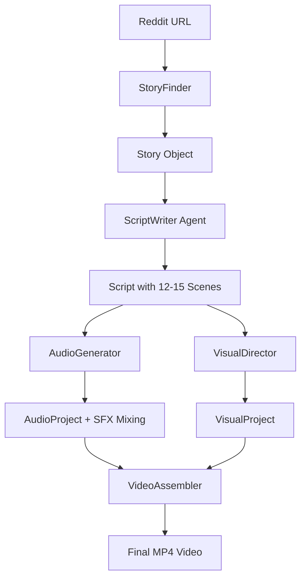
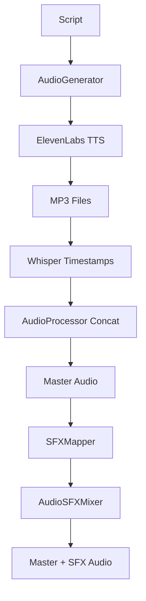
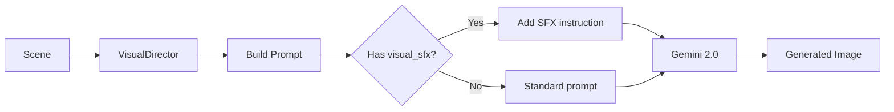

# GossipToon Architecture Documentation

> **Last Updated**: 2025-12-31  
> **Version**: 0.2.0 (with Audio SFX System)

## Table of Contents

1. [System Overview](#system-overview)
2. [Pipeline Architecture](#pipeline-architecture)
3. [Agent System (LangChain)](#agent-system-langchain)
4. [Data Models](#data-models)
5. [Audio System](#audio-system)
6. [Visual System](#visual-system)
7. [Video Assembly](#video-assembly)
8. [Feature Timeline](#feature-timeline)

---

## System Overview

**GossipToon** transforms viral Reddit stories into engaging YouTube Shorts with:

- AI-generated 5-act narrative structure
- Emotional voice acting (ElevenLabs)
- Cinematic AI visuals (Gemini)
- Dynamic hybrid subtitles
- Audio sound effects (SFX)

**Tech Stack**:

- **LLM Framework**: LangChain (JSON-structured outputs)
- **Models**: OpenAI GPT-4, Google Gemini 2.0 Flash
- **Audio**: ElevenLabs TTS, Whisper (timestamps)
- **Video**: FFmpeg (assembly), pydub (audio mixing)
- **Data**: Pydantic models (type-safe)

---

## Pipeline Architecture

### High-Level Flow



### Orchestrator Pattern

**File**: `src/gossiptoon/pipeline/orchestrator.py`

The `PipelineOrchestrator` coordinates all stages:

```python
class PipelineOrchestrator:
    async def run(self, story_url: str) -> PipelineResult:
        # 1. Extract story
        story = await self._run_story_finder(story_url)

        # 2. Generate script (LangChain Agent)
        script = await self._run_script_writer(story)

        # 3. Generate audio + SFX
        audio_project = await self._run_audio_generator(script)

        # 4. Generate visuals
        visual_project = await self._run_visual_director(script)

        # 5. Assemble video
        video_project = await self._run_video_assembler(visual_project, audio_project)

        return PipelineResult(success=True, video_project=video_project)
```

**Key Features**:

- Checkpoint system (resume from any stage)
- Error handling with retries
- Progress tracking
- Async execution

---

## Agent System (LangChain)

### Overview

GossipToon uses **LangChain's Structured Output** pattern for all agents. This ensures type-safe, validated responses.

### Agent Architecture

**Base Pattern**:

```python
from langchain.chat_models import ChatOpenAI
from langchain.output_parsers import PydanticOutputParser

class BaseAgent:
    def __init__(self):
        self.llm = ChatOpenAI(model="gpt-4", temperature=0.7)
        self.parser = PydanticOutputParser(pydantic_object=OutputModel)

    async def execute(self, input_data) -> OutputModel:
        # 1. Build prompt
        prompt = self._build_prompt(input_data)

        # 2. Call LLM
        response = await self.llm.ainvoke(prompt)

        # 3. Parse & validate
        result = self.parser.parse(response.content)

        return result
```

### ScriptWriter Agent

**File**: `src/gossiptoon/agents/script_writer.py`

**Responsibility**: Transform Reddit story → 5-act dramatic script

**Input**: `Story` (title, body, subreddit)  
**Output**: `Script` (acts, scenes, narrations, emotions, SFX)

**System Prompt Structure**:

```python
SYSTEM_PROMPT = """
You are a master storyteller for YouTube Shorts.

**5-Act Structure:**
1. Hook (0.5-3s): Grab attention immediately
2. Setup (8-12s): Establish characters and conflict
3. Crisis (10-15s): Escalate tension
4. Climax (10-15s): Peak drama
5. Resolution (6-10s): Conclude with reflection

**Scene Requirements:**
- Max 30 words per narration
- Emotion tags: angry, excited, shocked, dramatic, etc.
- Camera effects: zoom_in, pan_left, shake, static
- Optional: visual_sfx (BAM!, DOOM, LOOM, etc.)

**SFX Library:**
- **Tension**: DOOM (orchestral sub-bass), DUN-DUN (suspense), LOOM (menacing drone), RUMBLE (earthquake)
- **Action**: SQUEEZE, GRAB, GRIP, CLENCH, CRUSH (foley sounds)
- **Impact**: BAM! (punch), WHAM! (collision), THUD (fall), TA-DA! (success)

Use 2-4 SFX max per video for dramatic moments.
"""
```

**LangChain Integration**:

```python
from langchain_core.prompts import ChatPromptTemplate

class ScriptWriter:
    async def write_script(self, story: Story) -> Script:
        # Define output schema
        parser = PydanticOutputParser(pydantic_object=Script)

        # Build prompt
        prompt = ChatPromptTemplate.from_messages([
            ("system", self.SYSTEM_PROMPT),
            ("user", "Story: {title}\n\n{body}")
        ])

        # Create chain
        chain = prompt | self.llm | parser

        # Execute
        script = await chain.ainvoke({
            "title": story.title,
            "body": story.body
        })

        return script
```

**Why LangChain?**

1. **Type Safety**: Pydantic validation ensures correct structure
2. **Retry Logic**: Built-in error handling
3. **Prompt Management**: Easy to version and test prompts
4. **Traceability**: LangSmith integration for debugging

### VisualDirector Agent

**File**: `src/gossiptoon/visual/director.py`

**Responsibility**: Generate image prompts for each scene

**Global Style**:

```python
GLOBAL_STYLE = """
Korean Webtoon art style: clean lines, vibrant colors,
expressive characters, dramatic lighting,
comic panel composition, digital painting.
"""
```

**Character Consistency**:

- Tracks characters across scenes
- Maintains appearance descriptions
- Injects character details into prompts

**SFX Integration**:

```python
def _build_scene_prompt(self, scene: Scene) -> str:
    prompt = f"{GLOBAL_STYLE}\n{scene.visual_description}"

    # Add SFX instruction if present
    if scene.visual_sfx:
        prompt += f"\n\nINCLUDE: Bold comic-style text sound effect '{scene.visual_sfx}' integrated dramatically into the scene background."

    return prompt
```

---

## Data Models

All data structures use **Pydantic v2** for validation.

### Core Models

**Story** (`src/gossiptoon/models/story.py`):

```python
class Story(BaseModel):
    url: str
    title: str
    subreddit: str
    body: str
    score: int
    num_comments: int
```

**Scene** (`src/gossiptoon/models/script.py`):

```python
class Scene(BaseModel):
    scene_id: str
    act: ActType  # hook, setup, crisis, climax, resolution
    order: int
    narration: str  # Max 30 words
    emotion: EmotionTone  # angry, excited, shocked, etc.
    visual_description: str
    estimated_duration_seconds: float
    camera_effect: CameraEffect  # zoom_in, pan_left, shake, static
    visual_sfx: Optional[str] = None  # BAM!, DOOM, etc.
    characters_present: list[str]
```

**Script**:

```python
class Script(BaseModel):
    acts: list[Act]  # 5 acts
    total_estimated_duration: float
    target_audience: str
    content_warnings: list[str]

    def get_all_scenes(self) -> list[Scene]:
        """Flatten all scenes across acts."""
        return [scene for act in self.acts for scene in act.scenes]
```

### Audio Models

**AudioSegment** (`src/gossiptoon/models/audio.py`):

```python
class AudioSegment(BaseModel):
    scene_id: str
    audio_path: Path
    duration_seconds: float
    emotion: EmotionTone  # From ElevenLabs metadata
    word_timestamps: list[WordTimestamp]  # From Whisper
```

**WordTimestamp**:

```python
class WordTimestamp(BaseModel):
    word: str
    start: float  # seconds
    end: float
```

### Visual Models

**VisualAsset** (`src/gossiptoon/models/visual.py`):

```python
class VisualAsset(BaseModel):
    scene_id: str
    image_path: Path
    prompt_used: str
    generation_metadata: dict
```

---

## Audio System

### Three-Layer Architecture



### 1. Audio Generation

**File**: `src/gossiptoon/audio/generator.py`

```python
class AudioGenerator:
    async def generate_audio_project(self, script: Script) -> AudioProject:
        segments = []

        for scene in script.get_all_scenes():
            # Generate narration audio
            audio_path = await self.elevenlabs_client.generate_speech(
                text=scene.narration,
                emotion=scene.emotion
            )

            # Extract word timestamps
            timestamps = await self.whisper_processor.extract_timestamps(audio_path)

            segments.append(AudioSegment(
                scene_id=scene.scene_id,
                audio_path=audio_path,
                emotion=scene.emotion,
                word_timestamps=timestamps
            ))

        # Concatenate all segments
        master_audio = await self.audio_processor.concatenate_audio_files(
            [seg.audio_path for seg in segments]
        )

        return AudioProject(segments=segments, master_audio_path=master_audio)
```

### 2. SFX System (3 Phases)

#### Phase 1: SFX Library

**File**: `src/gossiptoon/audio/sfx_mapper.py`

```python
class SFXMapper:
    SFX_LIBRARY = {
        "DOOM": "assets/sfx/tension/doom.mp3",
        "BAM!": "assets/sfx/impact/bam.mp3",
        # ... 12 total
    }

    SFX_DESCRIPTIONS = {
        "DOOM": "Massive orchestral brass hit with heavy sub-bass drop",
        # ... detailed audio characteristics
    }

    def get_sfx_path(self, keyword: str) -> Optional[Path]:
        """Map SFX keyword to audio file."""
        return self.SFX_LIBRARY.get(keyword.upper())
```

#### Phase 2: Audio Mixing

**File**: `src/gossiptoon/audio/sfx_mixer.py`

```python
from pydub import AudioSegment

class AudioSFXMixer:
    def overlay_multiple_sfx(
        self,
        master_audio_path: Path,
        sfx_list: list[tuple[Path, float]],  # (sfx_path, offset_seconds)
        output_path: Path
    ) -> Path:
        # Load master
        mixed = AudioSegment.from_file(master_audio_path)

        # Overlay each SFX
        for sfx_path, offset_seconds in sfx_list:
            sfx = AudioSegment.from_file(sfx_path)

            # Volume adjustment (70% = -6dB)
            sfx = sfx + (20 * (0.7 - 1))  # -6dB

            # Overlay at offset
            offset_ms = int(offset_seconds * 1000)
            mixed = mixed.overlay(sfx, position=offset_ms)

        # Export
        mixed.export(output_path, format="mp3")
        return output_path
```

#### Phase 3: Pipeline Integration

**File**: `src/gossiptoon/pipeline/orchestrator.py`

```python
async def _overlay_audio_sfx(self, script: Script, audio_project: AudioProject) -> AudioProject:
    """Automatic SFX overlay based on scene.visual_sfx."""
    sfx_list = []
    current_offset = 0.0

    for scene, audio_segment in zip(script.get_all_scenes(), audio_project.segments):
        if scene.visual_sfx:
            # Map keyword to file
            sfx_path = SFXMapper().get_sfx_path(scene.visual_sfx)
            if sfx_path:
                sfx_list.append((sfx_path, current_offset))

        current_offset += audio_segment.duration_seconds

    # Apply all SFX
    if sfx_list:
        mixer = AudioSFXMixer(sfx_volume=0.7)
        mixed_audio = mixer.overlay_multiple_sfx(
            audio_project.master_audio_path,
            sfx_list
        )
        audio_project.master_audio_path = mixed_audio

    return audio_project
```

### 3. Subtitle System (Hybrid Mode)

**File**: `src/gossiptoon/video/subtitles.py`

**Two Modes**:

1. **RapidWord**: Word-by-word, pastel colors, 70% screen position
   - Triggered by: intense emotions (anger, excitement, shocked) or text heuristics (!, short sentences)
2. **SentenceMode**: Full sentence, yellow, bottom position
   - Used for: calm narration (neutral, sad)

```python
class SubtitleGenerator:
    def _is_intense_segment(self, audio_segment: AudioSegment, scene: Scene) -> bool:
        """Determine if segment should use rapid mode."""
        # Check emotion
        intense_emotions = {EmotionTone.ANGRY, EmotionTone.EXCITED, EmotionTone.SHOCKED}
        if audio_segment.emotion in intense_emotions:
            return True

        # Check text heuristics
        if '!' in scene.narration or len(scene.narration.split()) < 8:
            return True

        return False

    def generate_ass_subtitles(self, audio_segments, scenes) -> Path:
        header = self._generate_ass_header()  # Defines RapidWord + SentenceMode styles
        events = self._generate_events_hybrid(audio_segments, scenes)

        # Write .ass file
        ...
```

---

## Visual System

### Image Generation Flow



**File**: `src/gossiptoon/visual/director.py`

```python
class VisualDirector:
    GLOBAL_STYLE = "Korean Webtoon art style..."

    async def _generate_scene_image(self, scene: Scene, characters: dict) -> VisualAsset:
        # Build prompt
        prompt = self._build_scene_prompt(scene, characters)

        # Generate image (Gemini 2.0 Flash)
        image_bytes = await self.image_client.generate_image(prompt)

        # Save
        image_path = self.output_dir / f"{scene.scene_id}.png"
        image_path.write_bytes(image_bytes)

        return VisualAsset(scene_id=scene.scene_id, image_path=image_path)

    def _build_scene_prompt(self, scene: Scene, characters: dict) -> str:
        prompt_parts = [
            self.GLOBAL_STYLE,
            scene.visual_description,
            self._get_character_descriptions(scene, characters)
        ]

        # Add SFX if present
        if scene.visual_sfx:
            prompt_parts.append(
                f"INCLUDE: Bold comic-style text sound effect '{scene.visual_sfx}' "
                f"integrated dramatically into the scene background."
            )

        return "\n\n".join(prompt_parts)
```

---

## Video Assembly

### FFmpeg Pipeline

**File**: `src/gossiptoon/video/ffmpeg_builder.py`

**Key Features**:

1. **Universal Standardization**: Every segment → 1080x1920, 30fps, yuv420p
2. **Trim Filter**: Enforces exact duration (prevents AV sync drift)
3. **Camera Effects**: zoom_in, pan_left, shake, static
4. **Subtitle Overlay**: ASS format with dual styles

```python
class FFmpegBuilder:
    def _build_filter_complex(self, segments: list[VideoSegment]) -> str:
        filters = []

        for i, segment in enumerate(segments):
            # 1. Apply camera effect
            effect_filter = self._get_camera_effect_filter(segment)

            # 2. Universal standardization (CRITICAL for sync)
            standardize_filter = (
                f"[{i}:v]"
                f"{effect_filter},"
                f"trim=duration={segment.duration},"  # Exact duration
                f"scale=1080:1920:force_original_aspect_ratio=decrease,"
                f"pad=1080:1920:-1:-1:color=black,"
                f"setsar=1,"
                f"format=yuv420p,"
                f"fps=30"
                f"[v{i}]"
            )
            filters.append(standardize_filter)

        # 3. Concatenate
        concat_filter = f"{''.join([f'[v{i}]' for i in range(len(segments))])}concat=n={len(segments)}:v=1[outv]"

        return ";".join(filters + [concat_filter])
```

**Subtitle Integration**:

```python
def add_subtitles(self, subtitle_path: Path) -> "FFmpegBuilder":
    """Overlay ASS subtitles."""
    self.subtitle_file = subtitle_path
    # Applied in final render step
    # ffmpeg ... -vf "subtitles=file.ass" ...
```

---

## Feature Timeline

### Core System (v0.1.0)

- ✅ **TICKET-001 to 006**: Base pipeline, 5-act structure, Korean Webtoon style

### Recent Additions (v0.2.0)

#### TICKET-007: Extreme Dramatic Hook

- Hook duration: 0.5-3s (was 8-12s)
- Immediate attention-grabbing opener

#### TICKET-008: Rapid Word Subtitles

- ASS format
- Word-level timestamps
- Random pastel colors
- 70% screen position

#### TICKET-009: AV Sync Fix

- Added `trim=duration=...` filter
- Prevents `zoompan` frame drift
- Ensures exact segment timing

#### TICKET-010: Hybrid Subtitle Logic

- Dual modes: RapidWord (intense) + SentenceMode (calm)
- Emotion-based switching
- Text heuristics (!, short sentences)

#### TICKET-011: Visual SFX

- `Scene.visual_sfx` field
- ScriptWriter suggests SFX keywords
- Director injects into image prompts

#### TICKET-012, 013, 014: Audio SFX System

- **Phase 1**: SFX library (12 .mp3 files)
- **Phase 2**: AudioSFXMixer (pydub)
- **Phase 3**: Pipeline integration
- **Volume**: 70% (-6dB) configurable
- **Auto-overlay**: Based on scene offsets

---

## Configuration

**File**: `src/gossiptoon/core/config.py`

```python
class ConfigManager:
    def __init__(self):
        self.openai_api_key = os.getenv("OPENAI_API_KEY")
        self.google_api_key = os.getenv("GOOGLE_API_KEY")
        self.elevenlabs_api_key = os.getenv("ELEVENLABS_API_KEY")

        # Video settings
        self.output_width = 1080
        self.output_height = 1920
        self.fps = 30

        # Pipeline settings
        self.max_retries = 3
        self.target_duration = (50, 58)  # seconds
```

---

## Development Workflow

### Adding a New Agent

1. **Create Agent Class**:

```python
# src/gossiptoon/agents/my_agent.py
from langchain.output_parsers import PydanticOutputParser

class MyAgent:
    def __init__(self):
        self.llm = ChatOpenAI(model="gpt-4")
        self.parser = PydanticOutputParser(pydantic_object=MyOutputModel)

    async def execute(self, input_data) -> MyOutputModel:
        # Implement logic
        ...
```

2. **Define Pydantic Model**:

```python
# src/gossiptoon/models/my_model.py
class MyOutputModel(BaseModel):
    field1: str
    field2: int
```

3. **Integrate into Orchestrator**:

```python
# src/gossiptoon/pipeline/orchestrator.py
async def _run_my_agent(self, input_data):
    result = await self.my_agent.execute(input_data)
    logger.info(f"MyAgent completed")
    return result
```

### Testing

**Unit Test**:

```python
# tests/test_my_agent.py
import pytest

@pytest.mark.asyncio
async def test_my_agent():
    agent = MyAgent()
    result = await agent.execute(test_input)

    assert result.field1 == expected_value
```

**Integration Test**:

```bash
# Full pipeline
python -m gossiptoon.main run https://reddit.com/r/...

# Preview prompts
python scripts/preview_prompts.py
```

---

## LangChain Best Practices

### 1. Structured Outputs (Always Use)

```python
# ❌ Bad: Unstructured
response = llm.invoke("Generate a script...")
script_text = response.content  # Brittle parsing

# ✅ Good: Structured
parser = PydanticOutputParser(pydantic_object=Script)
chain = prompt | llm | parser
script = chain.invoke(...)  # Type-safe Script object
```

### 2. Prompt Management

```python
# Use ChatPromptTemplate for versioning
prompt = ChatPromptTemplate.from_messages([
    ("system", "You are an expert storyteller..."),
    ("user", "{input}")
])

# Not: f-strings scattered across code
```

### 3. Error Handling

```python
# Use retry decorators
@retry_async(max_retries=3, exceptions=(OutputParserException,))
async def write_script(self, story: Story) -> Script:
    ...
```

### 4. Async Everywhere

```python
# ✅ Good
results = await asyncio.gather(
    agent1.execute(),
    agent2.execute()
)

# ❌ Bad: Sequential
result1 = agent1.execute()  # Blocks
result2 = agent2.execute()
```

---

## Common Patterns

### Pattern 1: Multi-Stage Agent

```python
class ComplexAgent:
    async def execute(self, input_data):
        # Stage 1: Analysis
        analysis = await self._analyze(input_data)

        # Stage 2: Generation (uses analysis)
        output = await self._generate(analysis)

        # Stage 3: Validation
        validated = self._validate(output)

        return validated
```

### Pattern 2: Fallback Chain

```python
# Try primary agent, fallback to simpler one
try:
    result = await self.primary_agent.execute(input)
except LLMException:
    result = await self.fallback_agent.execute(input)
```

### Pattern 3: Checkpoint Recovery

```python
# Save after each stage
await self.checkpoint_manager.save(PipelineStage.SCRIPT, script)

# Resume from last checkpoint
checkpoint = await self.checkpoint_manager.load(project_id)
if checkpoint.stage == PipelineStage.SCRIPT:
    script = self._load_script_from_checkpoint(checkpoint)
    # Skip script generation, continue from audio
```

---

## Troubleshooting

### Common Issues

**1. LLM Output Validation Errors**

```
Error: Input should be 'angry', 'excited', ... [type=enum]
```

**Fix**: Update ScriptWriter prompt with valid enum values

**2. AV Sync Drift**

```
Video: 65s, Audio: 60s
```

**Fix**: Ensured by `trim=duration=...` filter (TICKET-009)

**3. SFX Not Playing**

```
No SFX to overlay
```

**Fix**: Check `scene.visual_sfx` is set and file exists in `assets/sfx/`

**4. Gemini Rate Limits**

```
Image generation failed: Gemini did not return an image
```

**Fix**: Retry logic (3 attempts), or use fallback image generator

---

## Future Enhancements

Planned features for v0.3.0:

1. **TICKET-015**: SFX Volume Tuning (30% background)
2. **TICKET-016**: EngagementWriter Agent (separate from ScriptWriter)
3. **TICKET-017**: Text Overlay Rendering (top-positioned hooks)
4. **Background Music**: Continuous ambient track (20-30% volume)
5. **A/B Testing**: Compare different subtitle styles, SFX frequencies
6. **Multi-Language**: Support Spanish, French, etc.

---

## Resources

### Documentation

- [LangChain Docs](https://python.langchain.com/)
- [Pydantic v2](https://docs.pydantic.dev/latest/)
- [FFmpeg Filters](https://ffmpeg.org/ffmpeg-filters.html)
- [ElevenLabs API](https://elevenlabs.io/docs)

### Internal

- `WORKLOG.md`: Development history
- `tickets/done/`: Completed feature tickets
- `scripts/`: Utility scripts (preview, reassemble)

### Contact

For questions about architecture or LangChain usage, refer to code comments or create a ticket in `tickets/todo/`.
