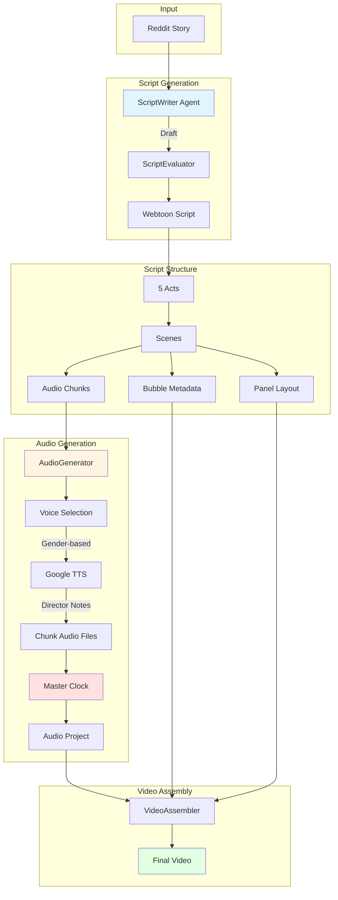
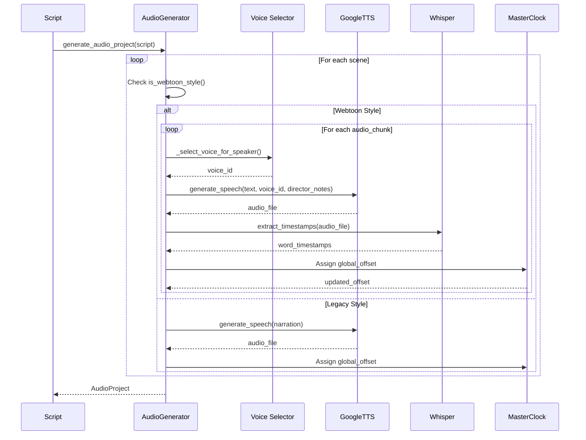
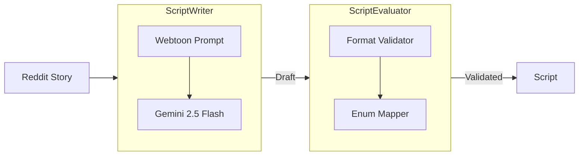

# Webtoon Engine Architecture

**Last Updated:** 2026-01-01  
**Status:** Sprint 3 In Progress (Phase 2-4 Complete)  
**Version:** 0.3.0

---

## Table of Contents

1. [Overview](#overview)
2. [Architecture Diagram](#architecture-diagram)
3. [Sprint Progress](#sprint-progress)
4. [Data Models](#data-models)
5. [Audio Generation Pipeline](#audio-generation-pipeline)
6. [Script Generation](#script-generation)
7. [Configuration](#configuration)
8. [Usage Examples](#usage-examples)
9. [Migration Guide](#migration-guide)
10. [Troubleshooting](#troubleshooting)

---

## Overview

The **Webtoon Engine** transforms GossipToon from a single-narrator narration system into a **multi-character dialogue-driven** Korean Webtoon-style video generator.

### Key Features

- ✅ **Multi-Character Dialogue** - 2-5 characters with distinct voices
- ✅ **Chunk-Level Audio** - Fragmented TTS generation per dialogue/narration
- ✅ **Director Notes** - Detailed TTS styling instructions for emotional delivery
- ✅ **Chat Bubbles** - Positioned speech bubbles with webtoon aesthetics
- ✅ **Master Clock** - Precise timing synchronization (±50ms accuracy)
- ✅ **Speaker-Based Voices** - Gender-based voice selection with consistency
- ✅ **Backward Compatible** - Legacy narration mode still supported

### Before vs After

| Aspect        | Legacy (Before)       | Webtoon (After)               |
| ------------- | --------------------- | ----------------------------- |
| **Narration** | Single narrator voice | Multi-character dialogue      |
| **Audio**     | 1 TTS call per scene  | Multiple TTS calls per chunk  |
| **Voices**    | Same voice throughout | Different voice per character |
| **Styling**   | Emotion-based         | Director notes-based          |
| **Visuals**   | Static text           | Chat bubbles with positioning |
| **Timing**    | Scene-level           | Chunk-level with Master Clock |

---

## Architecture Diagram



---

## Sprint Progress

### Sprint 1: Data Model Foundation ✅ MERGED

**Status:** Merged to main (PR #5)  
**Duration:** 1 day  
**Commit:** `24cb8c1`

**Deliverables:**

- ✅ `AudioChunk` model (chunk_id, chunk_type, speaker_id, text, director_notes)
- ✅ `AudioChunkType` enum (NARRATION, DIALOGUE, INTERNAL)
- ✅ `BubbleMetadata` model (position, style, character_name)
- ✅ Enhanced `Scene` model (audio_chunks, panel_layout, bubble_metadata)
- ✅ Helper methods (`is_webtoon_style()`, `get_all_speakers()`, `get_dialogue_chunks()`)
- ✅ Backward compatibility validation

**Files Changed:**

- `src/gossiptoon/models/audio.py` (+108 lines)
- `src/gossiptoon/models/script.py` (+108 lines)

---

### Sprint 2: Fragmented Audio Generation ✅ MERGED

**Status:** Merged to main (PR #5)  
**Duration:** 1 day  
**Commit:** `2440ffb`

**Deliverables:**

- ✅ `_generate_chunk_audio()` - Chunk-level TTS generation
- ✅ `_select_voice_for_speaker()` - Gender-based voice selection
- ✅ `_generate_scene_audio_chunks()` - Scene chunk processing
- ✅ Master Clock implementation (`current_offset` tracking)
- ✅ Hybrid scene support (legacy + webtoon)
- ✅ Google TTS integration with `style_instruction`

**Files Changed:**

- `src/gossiptoon/audio/generator.py` (+195 lines)
- `WORKLOG.md` (+97 lines)

**Key Features:**

```python
# Master Clock Timeline
Scene 1: Chunk 1 (offset=0.0s, duration=2.5s)
         Chunk 2 (offset=2.5s, duration=2.0s)
         Chunk 3 (offset=4.5s, duration=1.5s)
Total: 6.0s (from Master Clock)
```

---

### Sprint 3: ScriptWriter Enhancement 🚧 IN PROGRESS

**Status:** Phase 2-4 Complete (Phase 5-8 Remaining)  
**Duration:** 2-3 days (estimated)  
**Branch:** `feature/webtoon-engine-sprint3`

**Completed Phases:**

#### Phase 1: System Prompt Update ✅

- Updated `SYSTEM_PROMPT` to Korean Webtoon style
- Added audio_chunks structure explanation
- Included director_notes examples
- Added bubble positioning guidelines

#### Phase 2: USER_PROMPT_TEMPLATE ✅

- Explicit webtoon-style output request
- Character identification (2-5 characters)
- Gender assignment instructions
- Dialogue transformation guidelines
- Audio_chunks, director_notes, bubble_metadata requirements

#### Phase 3: ScriptEvaluator Enhancement ✅

- Updated `SYSTEM_PROMPT` for webtoon format validation
- Audio_chunks validation rules
- Bubble_metadata matching validation
- Backward compatibility maintained

#### Phase 4: Validation Methods ✅

- Replaced `_validate_narration_lengths()` with `_validate_audio_chunks()`
- Chunk text length validation (max 30 words)
- Director_notes validation (min 10 chars)
- Bubble_metadata count matching
- Dual-mode support (webtoon + legacy)

**Remaining Phases:**

- ⏳ Phase 5: Readable Output Update
- ⏳ Phase 6: Configuration & Toggles
- ⏳ Phase 7: Testing
- ⏳ Phase 8: Documentation & Cleanup

**Files Changed (So Far):**

- `src/gossiptoon/agents/script_writer.py` (+142 lines, -35 lines)
- `src/gossiptoon/agents/script_evaluator.py` (+43 lines, -27 lines)

---

## Data Models

### AudioChunk

Represents a single audio fragment (narration, dialogue, or internal monologue).

```python
from gossiptoon.models.audio import AudioChunk, AudioChunkType

chunk = AudioChunk(
    chunk_id="crisis_01_mother_01",
    chunk_type=AudioChunkType.DIALOGUE,
    speaker_id="Mother",
    speaker_gender="female",
    text="How could you do this to me?!",
    director_notes="a betrayed mother confronting her child, voice trembling with hurt and anger",
    estimated_duration=2.0,
    bubble_position="top-right",
    bubble_style="shout"
)
```

**Fields:**

- `chunk_id` (str): Unique identifier (format: `scene_id_speaker_##`)
- `chunk_type` (AudioChunkType): NARRATION, DIALOGUE, or INTERNAL
- `speaker_id` (str): Character name or "Narrator"
- `speaker_gender` (str): "male" or "female" (for voice selection)
- `text` (str): Spoken text (1-200 chars, max 30 words)
- `director_notes` (str): TTS styling instruction (min 10 chars)
- `estimated_duration` (float): Expected duration (0.1-10.0s)
- `bubble_position` (str, optional): "top-left", "top-right", "center", etc.
- `bubble_style` (str, optional): "speech", "thought", "shout", "whisper"

---

### BubbleMetadata

Defines chat bubble overlay positioning and styling.

```python
from gossiptoon.models.audio import BubbleMetadata

bubble = BubbleMetadata(
    chunk_id="crisis_01_mother_01",
    text="How could you do this to me?!",
    position="top-right",
    style="shout",
    character_name="Mother",
    timestamp_start=2.5,
    timestamp_end=4.5
)
```

**Fields:**

- `chunk_id` (str): Links to AudioChunk
- `text` (str): Bubble text (1-200 chars)
- `position` (str): Bubble position
- `style` (str): Bubble style
- `character_name` (str): Speaker name
- `timestamp_start` (float, optional): Start time
- `timestamp_end` (float, optional): End time

---

### Scene (Enhanced)

Scene model now supports both legacy and webtoon styles.

```python
from gossiptoon.models.script import Scene
from gossiptoon.core.constants import ActType, EmotionTone

# Webtoon-style scene
scene = Scene(
    scene_id="crisis_01",
    act=ActType.CRISIS,
    order=0,
    audio_chunks=[...],  # List of AudioChunk
    panel_layout="Korean webtoon panel: Close-up on Mother's shocked face",
    bubble_metadata=[...],  # List of BubbleMetadata
    emotion=EmotionTone.DRAMATIC,
    visual_description="Dramatic confrontation scene",
    characters_present=["Mother", "John"],
    estimated_duration_seconds=6.0
)

# Check if webtoon-style
if scene.is_webtoon_style():
    speakers = scene.get_all_speakers()  # ["Mother", "John", "Narrator"]
    dialogue = scene.get_dialogue_chunks()  # Only dialogue chunks
```

**New Fields:**

- `audio_chunks` (list[AudioChunk]): Sequence of audio fragments
- `panel_layout` (str, optional): Korean webtoon panel description
- `bubble_metadata` (list[BubbleMetadata]): Chat bubble data

**Helper Methods:**

- `is_webtoon_style()` → bool: Check if scene uses audio_chunks
- `get_all_speakers()` → list[str]: Get unique speaker list
- `get_dialogue_chunks()` → list[AudioChunk]: Filter dialogue chunks

---

## Audio Generation Pipeline

### Flow Diagram



### Voice Selection Logic

```python
def _select_voice_for_speaker(speaker_id, speaker_gender, chunk_type):
    # Narrator uses default voice
    if speaker_id == "Narrator" or chunk_type == AudioChunkType.NARRATION:
        return config.audio.default_voice_id

    # Characters use gender-based voice selection
    if hasattr(tts_client, "get_recommended_voice_for_gender"):
        # Consistent voice per character (hash-based index)
        character_index = hash(speaker_id) % 5
        voice_id = tts_client.get_recommended_voice_for_gender(
            gender=speaker_gender or "female",
            index=character_index
        )
        return voice_id

    # Fallback
    return config.audio.default_voice_id
```

**Voice Mapping Example:**

- Narrator → `default_voice_id` (e.g., Rachel)
- Mother (female, hash=2) → `Kore` (always consistent)
- John (male, hash=4) → `Charon` (always consistent)

### Master Clock

The Master Clock ensures precise timing synchronization across all audio chunks.

```python
current_offset = 0.0  # Master Clock starts at 0

for scene in script.get_all_scenes():
    if scene.is_webtoon_style():
        for chunk in scene.audio_chunks:
            # Generate audio
            audio_segment = await _generate_chunk_audio(chunk, current_offset)

            # Update Master Clock
            current_offset += audio_segment.duration_seconds

            # Segment has global_offset for precise timing
            print(f"Chunk {chunk.chunk_id}: offset={audio_segment.global_offset}s")
```

**Benefits:**

- ±50ms timing accuracy
- No drift between audio and visuals
- Precise chat bubble synchronization
- Supports complex multi-character timing

---

## Script Generation

### ScriptWriter Workflow



### Prompt Structure

**System Prompt (ScriptWriter):**

- Korean Webtoon scriptwriter persona
- Multi-character dialogue emphasis
- Audio_chunks structure explanation
- Director_notes examples
- Bubble positioning guidelines

**User Prompt (ScriptWriter):**

- Story content
- Character identification instructions (2-5 characters)
- Gender assignment guidelines
- Dialogue transformation rules
- Output format specification

**System Prompt (ScriptEvaluator):**

- Chief Editor persona
- Webtoon format validation rules
- Audio_chunks validation
- Bubble_metadata matching
- Backward compatibility support

### Example Output

```json
{
  "scene_id": "crisis_01",
  "act": "crisis",
  "order": 0,
  "audio_chunks": [
    {
      "chunk_id": "crisis_01_narrator_01",
      "chunk_type": "narration",
      "speaker_id": "Narrator",
      "speaker_gender": "female",
      "text": "The truth was about to come out.",
      "director_notes": "a suspenseful narrator building tension, hushed and mysterious",
      "estimated_duration": 2.5
    },
    {
      "chunk_id": "crisis_01_mother_01",
      "chunk_type": "dialogue",
      "speaker_id": "Mother",
      "speaker_gender": "female",
      "text": "How could you do this to me?!",
      "director_notes": "a betrayed mother confronting her child, voice trembling with hurt and anger",
      "estimated_duration": 2.0,
      "bubble_position": "top-right",
      "bubble_style": "shout"
    }
  ],
  "panel_layout": "Korean webtoon panel: Close-up on Mother's shocked face, tears forming",
  "bubble_metadata": [
    {
      "chunk_id": "crisis_01_mother_01",
      "text": "How could you do this to me?!",
      "position": "top-right",
      "style": "shout",
      "character_name": "Mother"
    }
  ],
  "emotion": "dramatic",
  "visual_description": "Dramatic confrontation scene in dimly lit kitchen",
  "characters_present": ["Mother", "John"],
  "estimated_duration_seconds": 4.5
}
```

---

## Configuration

### Config Options

```python
# config.yaml or .env

# Webtoon Mode (default: True)
WEBTOON_MODE=true

# Character Limits
MIN_CHARACTERS=2
MAX_CHARACTERS=5

# Audio Settings
DEFAULT_VOICE_ID=21m00Tcm4TlvDq8ikWAM
TTS_PROVIDER=google  # or elevenlabs

# Google TTS Settings
GOOGLE_TTS_MODEL=en-US-Studio-O
GOOGLE_TTS_SPEAKING_RATE=1.0
GOOGLE_TTS_PITCH=0.0
```

### Toggling Modes

```python
from gossiptoon.core.config import ConfigManager

config = ConfigManager()

# Enable webtoon mode
config.script.webtoon_mode = True

# Disable webtoon mode (use legacy)
config.script.webtoon_mode = False
```

---

## Usage Examples

### Generate Webtoon-Style Video

```python
from gossiptoon.pipeline.orchestrator import PipelineOrchestrator
from gossiptoon.core.config import ConfigManager

# Initialize
config = ConfigManager()
config.script.webtoon_mode = True  # Enable webtoon mode
orchestrator = PipelineOrchestrator(config)

# Run pipeline
result = await orchestrator.run(
    story_url="https://reddit.com/r/AmItheAsshole/..."
)

# Check script style
script = result.script
for scene in script.get_all_scenes():
    if scene.is_webtoon_style():
        print(f"Scene {scene.scene_id}: {len(scene.audio_chunks)} chunks")
        for chunk in scene.audio_chunks:
            print(f"  - {chunk.speaker_id}: {chunk.text}")
```

### Generate Legacy-Style Video

```python
# Use legacy mode
config.script.webtoon_mode = False
orchestrator = PipelineOrchestrator(config)

result = await orchestrator.run(story_url="...")

# All scenes will use narration
for scene in result.script.get_all_scenes():
    print(f"Scene {scene.scene_id}: {scene.narration}")
```

---

## Migration Guide

### From Legacy to Webtoon

**Step 1: Update Configuration**

```python
config.script.webtoon_mode = True
```

**Step 2: Regenerate Scripts**

- Old scripts with `narration` will still work
- New scripts will have `audio_chunks`

**Step 3: Verify Audio Generation**

```python
# Check audio project
audio_project = result.audio_project

# Webtoon mode has chunk-level segments
for segment in audio_project.segments:
    if segment.chunk_id:
        print(f"Chunk: {segment.chunk_id}, offset: {segment.global_offset}s")
```

**Step 4: Test Video Output**

- Chat bubbles should appear
- Multiple voices should be distinct
- Timing should be precise

### Backward Compatibility

The system automatically detects scene type:

```python
for scene in script.get_all_scenes():
    if scene.is_webtoon_style():
        # Process as webtoon (audio_chunks)
        chunk_segments = await audio_gen._generate_scene_audio_chunks(scene)
    else:
        # Process as legacy (narration)
        segment = await audio_gen._generate_scene_audio(scene, voice_id)
```

---

## Troubleshooting

### Issue: LLM Not Generating audio_chunks

**Symptom:** ScriptWriter generates `narration` instead of `audio_chunks`

**Solution:**

1. Check `webtoon_mode` is enabled
2. Verify prompt includes audio_chunks instructions
3. Check LLM temperature (should be 0.7-0.9 for creativity)
4. Review ScriptEvaluator validation logs

### Issue: Voice Selection Not Working

**Symptom:** All characters have the same voice

**Solution:**

1. Verify Google TTS client has `get_recommended_voice_for_gender` method
2. Check `speaker_gender` is set in audio_chunks
3. Ensure `speaker_id` is consistent across scenes
4. Review voice selection logs

### Issue: Bubble Metadata Mismatch

**Symptom:** Warning: "bubble_metadata count doesn't match dialogue chunks"

**Solution:**

1. Check ScriptEvaluator is generating bubble_metadata
2. Verify each dialogue chunk has corresponding bubble
3. Review bubble_metadata validation in `_validate_audio_chunks`

### Issue: Master Clock Drift

**Symptom:** Audio/visual timing is off

**Solution:**

1. Verify `global_offset` is set for all segments
2. Check `current_offset` is updated correctly
3. Review Master Clock implementation in AudioGenerator
4. Ensure no manual duration overrides

---

## Next Steps

### Sprint 3 Remaining Work

- [ ] Phase 5: Update readable script output
- [ ] Phase 6: Add configuration toggles
- [ ] Phase 7: Create unit and integration tests
- [ ] Phase 8: Update documentation and create PR

### Future Enhancements

- **Sprint 4:** Video assembler updates for chat bubbles
- **Sprint 5:** Visual effects for webtoon aesthetics
- **Sprint 6:** Advanced character consistency (visual + voice)
- **Sprint 7:** Multi-language support

---

## References

- [Sprint 1 Implementation](file:///Users/changikchoi/Documents/Github/ssuljaengi/WORKLOG.md)
- [Sprint 2 Implementation](file:///Users/changikchoi/Documents/Github/ssuljaengi/WORKLOG.md)
- [Sprint 3 Plan](file:///Users/changikchoi/.gemini/antigravity/brain/259a0037-fade-4a3b-87d5-b88826891056/sprint3_implementation_plan.md)
- [Google TTS Documentation](file:///Users/changikchoi/Documents/Github/ssuljaengi/docs/GOOGLE_TTS.md)
- [Google TTS Multi-Speaker](file:///Users/changikchoi/Documents/Github/ssuljaengi/docs/GOOGLE_TTS_MULTI_SPEAKER.md)

---

**Document Version:** 1.0  
**Last Updated:** 2026-01-01  
**Maintained By:** GossipToon Development Team
